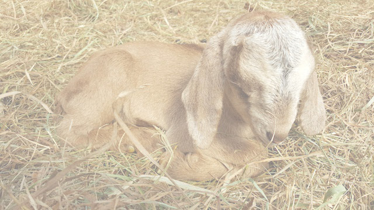

We keep a herd of French Alpine and Oberhasli diary goats that we use for milk,
dairy, and meat. The goats also do a lot of work for us, helping to clear
brush. We enjoy cheesmaking, and craft a variety of flavored fresh cheeses, 
from garlic and
salt to rose honey, to peppered blueberry. We also make a brined feta, French
farmhouse bloomy rind cheese similar to the [St. Maure de
Touraine](https://en.wikipedia.org/wiki/Sainte-Maure_de_Touraine) and
[Pouligny-Saint-Pierre](https://en.wikipedia.org/wiki/Pouligny-Saint-Pierre_cheese)
cheeses of the Loire Valley region of France, and a blueberry wine brushed
[Tomme](https://en.wikipedia.org/wiki/Tomme) style.

